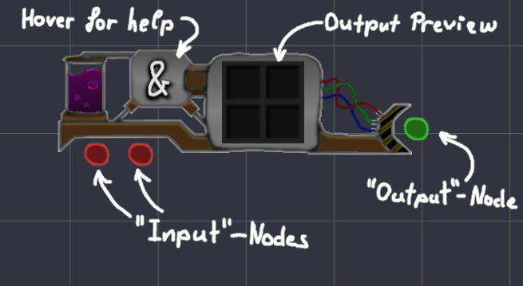
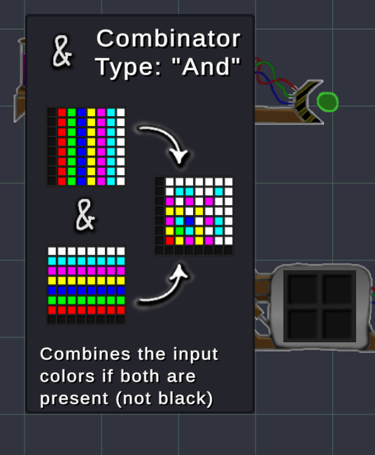

# Basic Controls:

* Left-Click to connect Outputs (red) to Inputs (green)  
  (you can also drag)
* Right-Click on a red/green Node to delete its connections
* Hover on machine icons to receive some help on how they work

 

# The User Interface

 

This is what you'll see when hovering on an icon:

